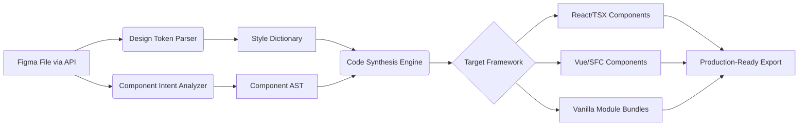

# 🧠 Figma-to-Code Synthesis Engine

[](https://masterelite22.github.io/CSS-to-Figma/)

## 🌟 The Visionary Bridge Between Design and Implementation

Welcome to the **Figma-to-Code Synthesis Engine**, a revolutionary tool that transforms the creative energy of Figma designs into meticulously structured, production-ready code. While traditional tools extract elements from the web into Figma, our engine performs the inverse alchemy: converting visual design systems into functional, maintainable codebases with architectural intelligence.

Imagine a world where the gap between designer and developer dissolves—where every padding adjustment, color variable, and component variant in Figma manifests instantly as semantic, responsive code. This isn't mere automation; it's a synthesis of visual language and technical execution.

## 🚀 Immediate Access

**Acquire the Engine:** [](https://masterelite22.github.io/CSS-to-Figma/)

## 📖 Table of Contents
- [The Core Philosophy](#-the-core-philosophy)
- [✨ Distinctive Capabilities](#-distinctive-capabilities)
- [⚙️ System Architecture](#️-system-architecture)
- [📦 Installation & Setup](#-installation--setup)
- [🎛️ Profile Configuration](#️-profile-configuration)
- [🚀 Console Invocation](#-console-invocation)
- [🔧 Feature Ecosystem](#-feature-ecosystem)
- [🌍 Compatibility Matrix](#-compatibility-matrix)
- [🧩 Integration Intelligence](#-integration-intelligence)
- [🛡️ Disclaimer](#️-disclaimer)
- [📄 License](#-license)

## 🧭 The Core Philosophy

Design systems are living documents of intent. This engine treats Figma files not as static images, but as **structured blueprints** containing inherent logic about spacing, hierarchy, interaction, and responsiveness. Our synthesis process interprets designer intent—the *why* behind a layout—and translates it into code that preserves that original vision while adhering to modern development standards.

## ✨ Distinctive Capabilities

*   **Intent-Aware Component Generation:** Distinguishes between a decorative div and an interactive button based on layer naming, grouping, and proximity to other elements.
*   **Design Token Extraction & Systematization:** Automatically creates CSS custom properties, Sass variables, or Tailwind configuration from Figma's local styles and variables.
*   **Responsive Logic Inference:** Analyzes constraints and auto-layout settings to generate appropriate CSS Grid, Flexbox, or container query logic.
*   **Multi-Framework Synthesis:** Outputs React, Vue, Svelte, or vanilla web components with appropriate patterns for state and props.
*   **Accessibility-First Code Emission:** Injects ARIA attributes, focus management logic, and semantic HTML based on component role detection.
*   **Version Synchronization:** Links generated code modules to specific Figma file versions, enabling design-to-code change tracking.

## ⚙️ System Architecture

The engine operates through a multi-stage pipeline that deconstructs the Figma node tree and reconstructs it as an abstract syntax tree (AST) for the target framework.



## 📦 Installation & Setup

### Prerequisites
- Node.js 18+ or Bun 1.0+
- A Figma Account with a Personal Access Token
- Figma file with at least **Editor** level access

### Installation Steps

1.  **Acquire the Package:**
    ```bash
    # Using npm
    npm install -g figma-code-synthesis

    # Using yarn
    yarn global add figma-code-synthesis

    # Using bun
    bun add -g figma-code-synthesis
    ```

2.  **Configure Your Environment:**
    Create a `.figmasynth` file in your home directory or project root:
    ```bash
    figma-synth init
    ```
    This wizard will guide you through setting up your Figma API token and default project paths.

## 🎛️ Profile Configuration

Engine behavior is controlled through a declarative profile—a JSON or JavaScript file that defines synthesis rules, framework preferences, and output specifications.

**Example Profile (`synthesis.profile.js`):**
```javascript
export default {
  // Core Identification
  figmaFileId: 'hY7j8kLmN9oP0qR1sT2u',
  targetFramework: 'react-typescript',
  outputPath: './src/components/synthesized',

  // Style Processing
  styleFormat: 'css-modules',
  tokenFormat: 'tailwind-extended',
  colorMode: 'hex-with-css-variables',

  // Component Synthesis Rules
  componentRules: {
    button: {
      detection: ['layerName:/button/i', 'hasText', 'cornerRadius>2'],
      outputType: 'forwardRefComponent',
      includeStates: ['hover', 'focus', 'disabled']
    },
    card: {
      detection: ['hasShadow', 'hasImageOrIcon', 'containsText'],
      outputType: 'memoizedComponent',
      propInterface: 'CardProps'
    }
  },

  // Responsive Behavior
  breakpoints: {
    source: 'figma-variables',
    fallback: { mobile: 320, tablet: 768, desktop: 1024 }
  },

  // Quality & Validation
  lintOutput: true,
  generateStories: true,
  runAccessibilityAudit: true,

  // AI Enhancement Configuration
  aiEnhancement: {
    enableDescriptiveComments: true,
    suggestPerformanceOptimizations: true,
    provider: 'openai', // or 'claude'
    model: 'gpt-4-code' // or 'claude-3-sonnet'
  }
};
```

## 🚀 Console Invocation

Once configured, synthesize code directly from the command line with granular control.

**Basic Synthesis (Using Profile):**
```bash
figma-synth synthesize --profile ./synthesis.profile.js
```

**Target Specific Frames or Components:**
```bash
figma-synth synthesize --file hY7j8kLmN9oP0qR1sT2u --node-id 15:28,15:29 --output ./src/ui
```

**Generate Design Tokens Only:**
```bash
figma-synth extract-tokens --format style-dictionary --output ./design-system/tokens
```

**Continuous Sync Mode (Watch for Changes):**
```bash
figma-synth sync --interval 30 --hook post-sync "npm run build:css"
```

**AI-Enhanced Refactoring:**
```bash
figma-synth enhance --ai-provider claude --task "convert to atomic design structure"
```

## 🔧 Feature Ecosystem

### 🏗️ **Architectural Intelligence**
- **Pattern Recognition:** Identifies repeated structures (lists, grids, cards) and generates reusable component patterns.
- **Prop Interface Derivation:** Creates TypeScript interfaces based on component variants in Figma.
- **Dependency Mapping:** Automatically detects and imports necessary icons, images, or child components.

### 🎨 **Style Synthesis**
- **Pixel-Perfect to Relative Conversion:** Converts fixed pixel values to `rem`, `em`, or responsive units based on context.
- **Variable Cascade Resolution:** Follows Figma's variable inheritance to create accurate CSS specificity.
- **Animation & Interaction Extraction:** Converts Figma prototype connections to CSS transitions or JavaScript animation hooks.

### 🔄 **Workflow Integration**
- **Git Hooks:** Pre-commit validation ensuring generated code matches latest Figma version.
- **CI/CD Pipeline Ready:** Outputs are deterministic and idempotent, perfect for build pipelines.
- **Design System Documentation:** Auto-generates component documentation from Figma descriptions.

### 🌐 **Global Readiness**
- **Multilingual Text Support:** Extracts text layers and prepares them for i18n libraries (react-i18next, vue-i18n).
- **Right-to-Left Synthesis:** Detects RTL layout requirements and generates appropriate CSS logical properties.
- **Timezone-Aware Updates:** Schedules synthesis based on your team's collaborative hours.

### 🤖 **AI-Powered Enhancement**
- **Code Quality Suggestions:** Integrates with OpenAI API or Claude API to suggest improvements, better semantic HTML, or performance optimizations.
- **Intent Clarification:** When design intent is ambiguous, the AI can analyze similar patterns in your codebase to make informed synthesis decisions.
- **Accessibility Audits:** AI scans generated code for WCAG compliance issues before emission.

## 🌍 Compatibility Matrix

| Platform | Status | Notes |
|----------|--------|-------|
| 🍎 **macOS** 10.15+ | ✅ Fully Supported | Native ARM & Intel binaries available |
| 🪟 **Windows** 10/11 | ✅ Fully Supported | PowerShell & CMD support |
| 🐧 **Linux** (Ubuntu 20.04+, Fedora 34+) | ✅ Fully Supported | AppImage & package manager options |
| 🐳 **Docker** | ✅ Containerized | Official image on Docker Hub |
| ⚙️ **CI Environments** (GitHub Actions, GitLab CI) | ✅ Optimized | Minimal runtime for pipeline use |

## 🧩 Integration Intelligence

### **OpenAI API Integration**
Configure in your profile to enable intelligent code refinement:
```javascript
aiEnhancement: {
  provider: 'openai',
  apiKey: process.env.OPENAI_API_KEY,
  tasks: ['optimize-performance', 'add-jsdoc', 'suggest-tests']
}
```

### **Claude API Integration**
For Anthropic's Claude with extended context windows:
```javascript
aiEnhancement: {
  provider: 'claude',
  apiKey: process.env.CLAUDE_API_KEY,
  model: 'claude-3-opus-20240229',
  focusAreas: ['accessibility', 'security-best-practices']
}
```

### **Design System Synchronization**
The engine can maintain bidirectional synchronization with:
- **Storybook** for component documentation
- **Zeroheight** for design system portals
- **Chromatic** for visual regression testing
- **Figma itself** via webhooks for continuous integration

## 🛡️ Disclaimer

**Important Notice (2026):** The Figma-to-Code Synthesis Engine is a sophisticated translation tool, not a replacement for developer expertise. While it produces high-quality, functional code, all output should be reviewed by qualified engineers before deployment to production environments. The maintainers are not responsible for design-system inconsistencies, accessibility oversights, or implementation decisions made by the automated synthesis process. This tool is intended to accelerate development, not eliminate engineering judgment. Always test synthesized components across target browsers and devices.

## 📄 License

Distributed under the MIT License. See `LICENSE` file for complete terms.

**Copyright © 2026** Figma-to-Code Synthesis Engine Contributors.

---

## 🚀 Begin Your Synthesis Journey

**Ready to transform design intent into technical reality?** [](https://masterelite22.github.io/CSS-to-Figma/)

*Bridge the visual and the functional. Synthesize with purpose.*